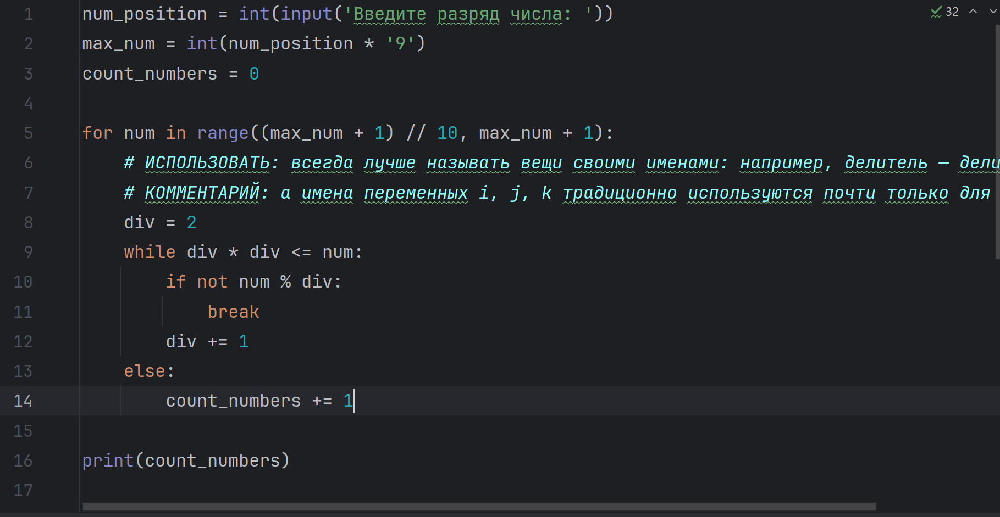
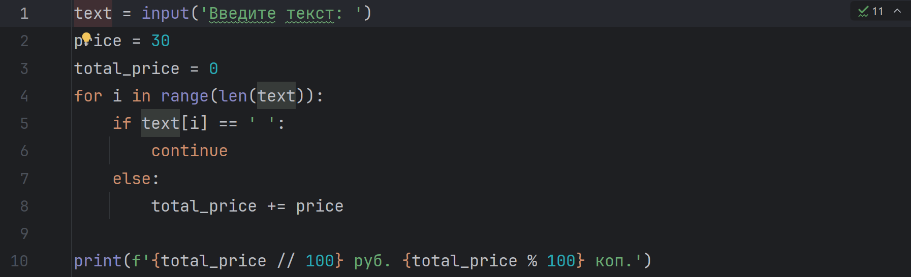
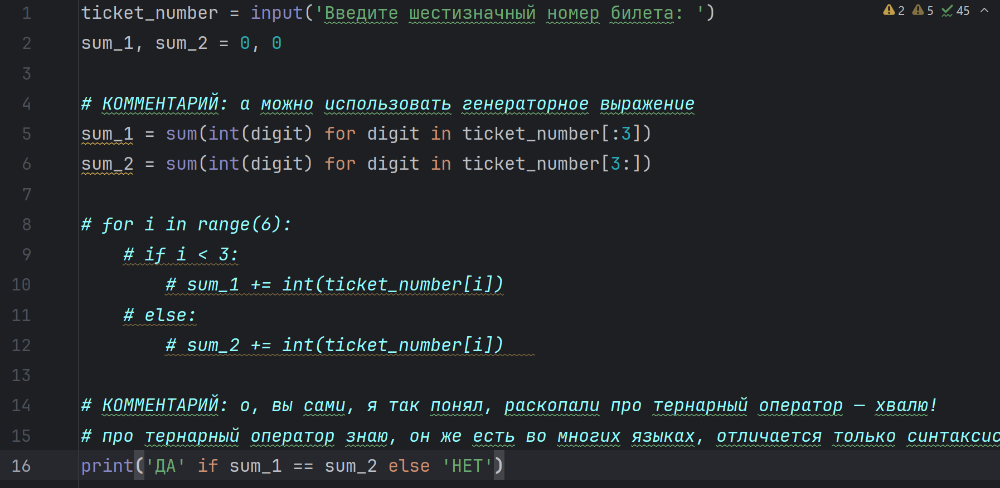
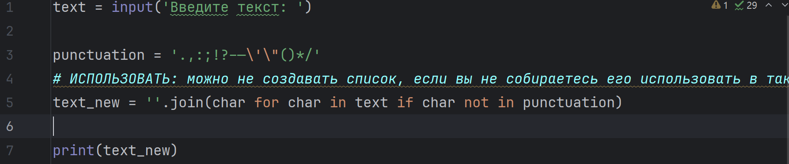
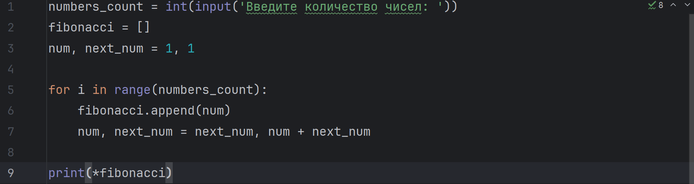

# Top-Python321
---

This is a collection of Python basic usage assignments where the teacher has arranged Python exercises for students, covering topics such as input/output operations, variables and data types, formatted output, conditional statements, loops, file handling and module imports, and function writing.

## ✨ Project Features

- 📝 Practice-Oriented  
    All tasks require students to write code themselves. This hands-on approach helps deepen their understanding and application of the Python programming language, effectively enhancing their coding skills.
- ✅ Gradual Difficulty Increase  
    Tasks start with basic input/output operations and variables, then progress to conditional statements and loops, and finally move on to function definitions, file operations, etc. This forms a learning path that gradually increases in difficulty.
- 💾 Comprehensive Knowledge Coverage  
    It covers many important aspects of Python programming, including but not limited to data types, control structures, functions, modules, file operations, exception handling, etc. This enables students to gain a comprehensive understanding and mastery of the Python programming language.
- 🎨 Feedback and Evaluation Mechanism  
    Students are asked to keep the output results of their code in the form of comments in the code files and report their assignment completion status in the designated "Журнал" service. This helps teachers evaluate and provide feedback on students' learning progress and outcomes.
- 🔑 Combined with Practical Applications  
    The tasks involve scenarios such as password strength checking, taxi fare calculation, and file operations, which are related to real-life or work situations. This enables students to apply their knowledge to practical problems.

## 🚀 Quick Start

### Clone the Project

```bash
git clone https://github.com/Glccccc/wuyanzu-group.git
cd wuyanzu-group
```

### Launch the Project
```bash  
cd wuyanzu-group/2023.04.09
python 1.py
python 2.py
...
```
The project will run in your local ```development environment```.
## 📦 Project Structure
```
wuyanzu-group/
├── 2023.04.09/
│   ├── # HW 2023.04.09.txt
│   ├── 1.py
│   ├── 2.py
│   ├── 3.py
│   ├── 4.py
│   └── 5.py
├── 2023.04.16/
├── 2023.04.23/
├── ...
└── README.md
```
## 📮 Project Main Function Description and Screenshots
<!-- by 管立超 -->

<!-- by 陈万程-->

### The main functionalities and screenshots of the programs in the directory '2023.04.23'

- #### 1.py


This program is used to record the numbers input by the user that can be divisible by 7, and then output these numbers in reverse order. To use this program, we need to input numbers that are divisible by 7. When a number that is not divisible by 7 is input, the program will output in reverse order of the numbers that are divisible by 7 input by the user and end the program

- #### 2.py


This program is used to calculate the sum of the positive numbers of the input. If we want to use this program, we need to input the total number of numbers to be input, and then input the integers in sequence. After input, the program will provide the sum of the positive numbers in the numbers input by the user

- #### 3.py


This program is used to calculate the sum of all divisors of a number. When using this program, input a positive integer, and then the program will output the sum of all divisors of that number

- 4.py



This program is used to calculate the total number of prime numbers in the specified number of digits. When using this program, users need to input an integer indicating the number of digits to be processed (for example, 3 represents three digits), and then the program will output an integer indicating the number of prime numbers within the digit range.

- 5.py



This program is used to calculate the total cost of a piece of text. When using this program, users need to input a piece of text, and then the program will output the total cost of this text

- 6.py



This program is used to determine whether a six-digit ticket is a "lucky ticket" (the sum of the first three digits is equal to the sum of the last three digits). When using this program, the user needs to input a six-digit number, and then the program will output "Yes" or "No".

- 7.py



This program is used to remove all the specified punctuation marks in the text input by the user. When using this program, the user needs to input a string, and then the program will output a new string without the specified symbol

- 8.py



This program is used to generate the Fibonacci sequence of the specified length. When using this program, users need to input a positive integer representing the length of the Fibonacci sequence to be output. Then the program will output a Fibonacci sequence separated by Spaces

<!-- by 陈万程-->