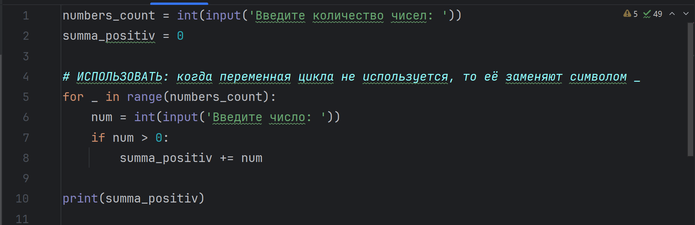
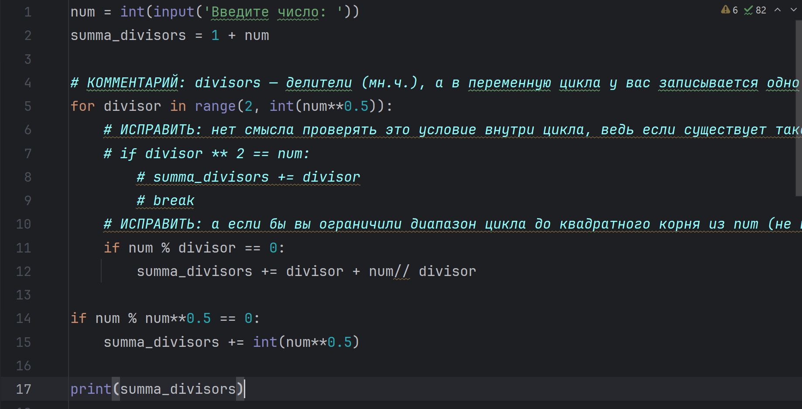

# Top-Python321
---

这是一个关于Python基础用法的作业，老师为学生布置了python的输入输出操作、变量和数据类型、格式化输出、条件语句、循环结构、处理文件操作和模块导入、函数编写等相关练习。

## ✨ 项目特点

- 📝 实践导向  
    所有任务都要求学生亲自动手编写代码，通过实践来加深对Python编程语言的理解和应用能力。这种实践导向的方式有助于学生更好地掌握编程技能。
- ✅ 逐步提升难度  
    任务从基础的输入输出操作、变量和数据类型，到条件语句、循环结构，再到函数定义与调用、文件操作等，逐步提升难度，形成一个由浅入深的学习路径。
- 💾 覆盖知识全面  
    涵盖了Python编程的多个重要方面，包括但不限于数据类型、控制结构、函数、模块、文件操作、异常处理等，使学生能够全面地了解和掌握Python编程语言。
- 🎨 反馈和评估机制  
    要求学生在代码文件中以注释的形式保留程序运行的输出结果，并在指定的“Журнал”服务中报告作业完成情况，这有助于教师对学生的学习进度和成果进行评估和反馈。
- 🔑 与实际应用结合  
    任务中涉及的场景如密码强度检查、出租车费用计算、文件操作等，都是与实际生活或工作相关的应用场景，使学生能够将所学知识应用到实际问题中。

## 🚀 快速开始

### 克隆项目

``` bash
git clone https://github.com/Glccccc/wuyanzu-group.git
cd wuyanzu-group
```

### 启动项目

```bash
cd wuyanzu-group/2023.04.09
python 1.py
python 2.py
...
```

项目将运行在 `本地的开发环境`

## 📦 项目结构

```
wuyanzu-group/
├── 2023.04.09/
│   ├── # HW 2023.04.09.txt
│   ├── 1.py
│   ├── 2.py
│   ├── 3.py
│   ├── 4.py
│   └── 5.py
├── 2023.04.16/
├── 2023.04.23/
├── ...
└── README.md
```
<!-- by 管立超 -->

## 📮 项目主要功能说明与截图

<!-- by 陈万程-->

### 目录“2023.04.23”中程序的主要功能和截图

- #### 1.py


这个程序用于记录用户输入的能被7整除的数，然后将这些数逆序输出。要使用这个程序，我们需要输入能被7整除的数字。当输入一个不能被7整除的数字时，程序将按用户输入的能被7整除的数字的倒序输出，并结束程序

- #### 2.py



这个程序用于计算输入的正数之和。如果我们想要使用这个程序，我们需要输入待输入的数字总数，然后按顺序输入整数。输入后，程序将给出用户输入的数字中正数的和

- #### 3.py



这个程序用于计算一个数的所有除数之和。使用这个程序时输入一个正整数，然后程序将输出该数的所有除数之和

- 4.py


这个程序用于计算指定位数中质数的总数。使用这个程序时需要用户输入一个整数，表示要处理的数字位数（如3代表三位数），然后程序会输出一个整数，表示位数范围内有多少个质数。

- 5.py


这个程序用于计算一段文本的总费用。使用这个程序时需要用户输入一段文本，然后程序会输出这段文本的总费用

- 6.py


这个程序用于判断一个六位数的车票是否为“幸运票”（前三位数字之和等于后三位数字之和）。使用这个程序时用户需要输入一个六位数，然后程序会输出‘是’或者‘否’

- 7.py


这个程序用于去除用户输入文本中的所有指定标点符号。使用这个程序时用户需要输入一个字符串，然后程序将输出一个不含指定符号的新字符串

- 8.py


这个程序用于生成指定长度的斐波那契数列。使用这个程序时用户需要输入一个正整数，表示需要输出的斐波那契数列的长度，然后程序会输出一个以空格分隔的斐波那契数列

<!-- by 陈万程-->